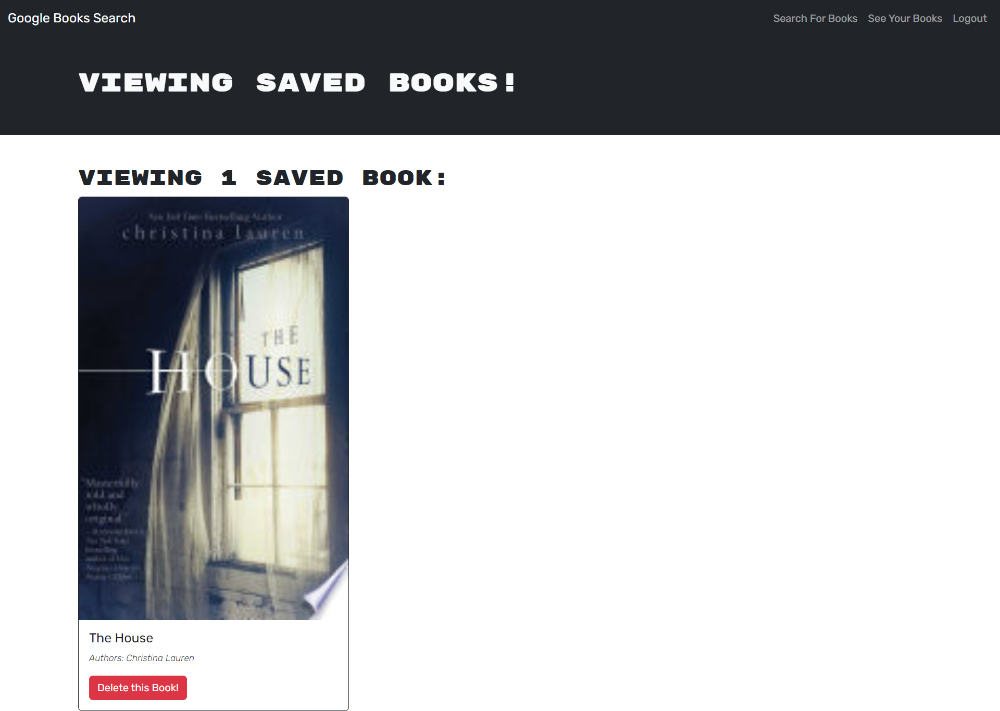
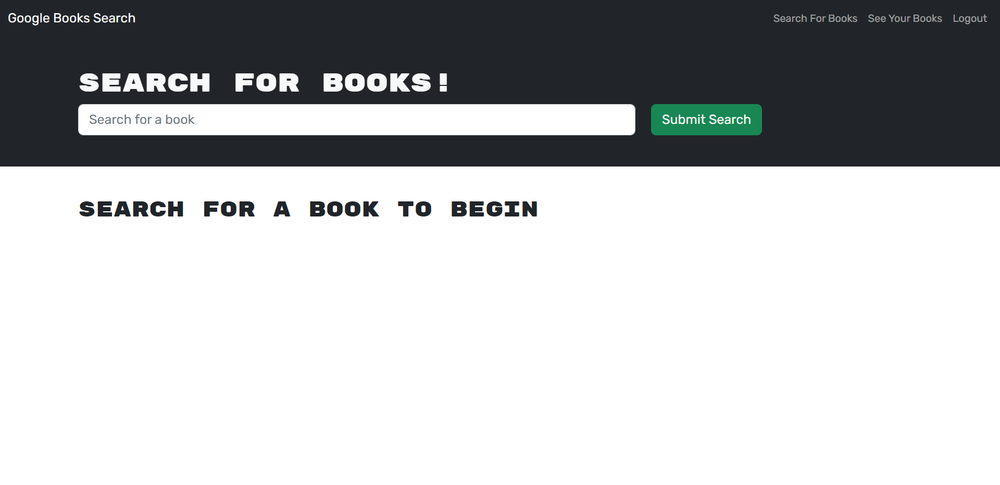

# Lucas-Google-Books

## Description

This project is a factor of a project that was formerly using REST API. I refactored this project as a way to practice my skills using graphql. This was one of the hardest projects I have had to refactor. Because of the mix of REST and GraphQL, this project was more confusing, but I am confident in the results I have. I still prefer REST over GraphQl, but I believe this was a good exercise for me to practice my GraphQl skills.

Technologies used include: GraphQl, Express.js, Bcrypt, Apollo-Server-Express, Apollo-Client, Nodemon, Jsonwebtoken, Node.js and mongoose.

## Installation

The following must be installed to run locally; GraphQl, Express.js, Bcrypt, Apollo-Server-Express, Apollo-Client, Nodemon, Jsonwebtoken, and Mongoose.

## Usage

To use this project, create an account, login, search a book and click the save button to save it to your account. If you would like to delete a book, simply click the remove book button.

## Credits

N/A

## License

N/A

## How to Contribute

For questions and contributions, you can reach me here:
[Email](mailto:bielinskilucas@gmail.com)
or
[Github](https://github.com/LucasBielinski)

